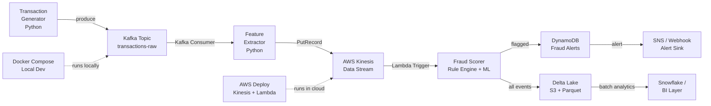

# Real-Time Payment Fraud Detection Pipeline

Real-time fraud signal pipeline that replaced a 24-hour nightly batch process with a streaming architecture delivering sub-60-second signal latency. Built with Kafka, AWS Kinesis, and DynamoDB — deployable locally via Docker Compose or on AWS.


---

## Problem

Fraud detection running on a nightly batch had a 24-hour signal lag — meaning fraudulent transactions weren't flagged until the following day. This pipeline replaces that batch with a streaming architecture that detects and flags fraud signals in under 60 seconds from transaction time.

---

## Architecture



### Signal flow

| Step | Component | Latency |
|---|---|---|
| Transaction produced | Kafka producer | < 1s |
| Feature extraction | Kafka consumer → Kinesis | < 5s |
| Fraud scoring | Lambda trigger | < 15s |
| Alert written | DynamoDB PutItem | < 1s |
| **End-to-end** | **Transaction → Alert** | **< 60s** |

---

## Stack

| Component | Local (Dev) | AWS (Prod) |
|---|---|---|
| Message broker | Apache Kafka (Docker) | AWS Kinesis Data Streams |
| Stream processor | Python consumer | AWS Lambda |
| Feature store | In-memory / Redis | DynamoDB |
| Alert sink | stdout / file | DynamoDB + SNS |
| Storage | Local Parquet | Delta Lake on S3 |
| Orchestration | Docker Compose | AWS CloudFormation |

---

## Project structure

```
realtime-fraud-detection/
├── producer/
│   ├── transaction_generator.py   # Simulates payment transaction stream
│   └── kafka_producer.py          # Publishes to Kafka topic
├── consumer/
│   ├── kafka_consumer.py          # Reads from Kafka, extracts features
│   └── kinesis_publisher.py       # Forwards enriched events to Kinesis
├── scorer/
│   ├── fraud_rules.py             # Rule-based fraud detection logic
│   ├── ml_scorer.py               # ML model scoring (optional)
│   └── dynamodb_writer.py         # Writes fraud alerts to DynamoDB
├── aws/
│   ├── lambda_handler.py          # AWS Lambda entry point
│   ├── cloudformation.yaml        # Infrastructure as code
│   └── kinesis_consumer.py        # Local Kinesis consumer for testing
├── storage/
│   └── delta_writer.py            # Writes all events to Delta Lake / S3
├── tests/
│   ├── test_producer.py
│   ├── test_fraud_rules.py
│   └── test_dynamodb_writer.py
├── docker-compose.yml             # Kafka + Zookeeper local setup
├── requirements.txt
└── .env.example
```

---

## How to run

### Prerequisites

- Python 3.9+
- Docker + Docker Compose
- AWS CLI configured (for AWS deployment only)

### Local (Kafka + Docker)

```bash
git clone https://github.com/hemanth-kamsani/realtime-fraud-detection.git
cd realtime-fraud-detection

# Start Kafka and Zookeeper
docker-compose up -d

# Install dependencies
pip install -r requirements.txt

# Start the transaction producer
python producer/transaction_generator.py --tps 100

# Start the consumer + feature extractor
python consumer/kafka_consumer.py

# Start the fraud scorer (writes alerts to local DynamoDB or stdout)
python scorer/fraud_rules.py
```

### AWS deployment

```bash
# Deploy infrastructure
aws cloudformation deploy \
  --template-file aws/cloudformation.yaml \
  --stack-name fraud-detection-stack \
  --capabilities CAPABILITY_IAM

# Deploy Lambda
zip -r lambda.zip scorer/
aws lambda update-function-code \
  --function-name fraud-scorer \
  --zip-file fileb://lambda.zip
```

---

## Fraud detection logic

Transactions are scored against the following rule categories:

| Rule | Signal |
|---|---|
| Velocity check | > 5 transactions from same card in 60s |
| Amount anomaly | Transaction > 3x 30-day average |
| Geographic mismatch | Two transactions > 500km apart within 10 min |
| Merchant category risk | High-risk MCC codes flagged |
| Card-not-present + new device | Combined risk factor |

---

## Key results

| Metric | Before | After |
|---|---|---|
| Signal latency | 24 hours (nightly batch) | < 60 seconds |
| Detection method | Batch SQL rules | Real-time streaming rules |
| Alert delivery | Next-day report | DynamoDB + SNS instant alert |

---

## Roadmap

- [ ] Add ML-based anomaly scorer (Isolation Forest / XGBoost)
- [ ] Flink processor replacing Lambda for stateful windowing
- [ ] Grafana dashboard for fraud signal monitoring
- [ ] Terraform replacing CloudFormation

---

## Author

**Hemanth Reddy Kamsani** — [LinkedIn](https://www.linkedin.com/in/hemanthkamsani/) · [GitHub](https://github.com/hemanth-kamsani)
